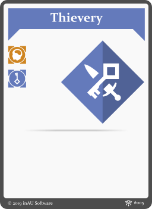
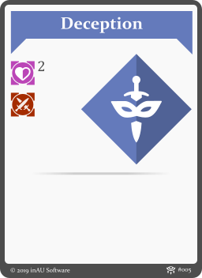
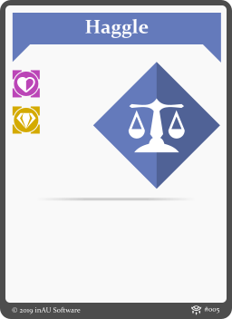
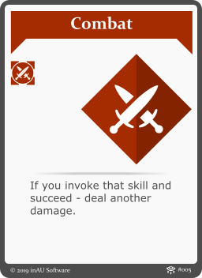
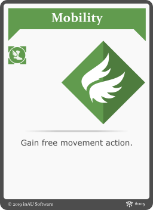
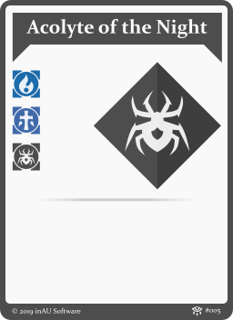

## 2.6 Skills

A **skill** represents a specific area of expertise that a character learned trought exercising. Your character will start the game with skills associated to it's origin and will aquire new ones as the game progresses.

Skills can be used to invoke associated aspects during a test, or to trigger skill specific action. Once used, a skill cannot be used again until rest. The number of used skills reflects character fatigue.

